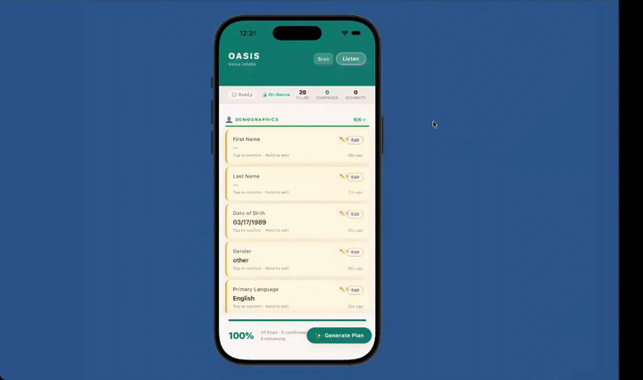

# OASIS

Voice-first intake for housing, disaster response, and frontline care.

OASIS is a mobile app that helps frontline workers replace long, rigid intake forms with a natural conversation. Instead of spending 30 to 60 minutes typing through paperwork, a caseworker can simply talk with a client while the app captures and structures key case information in real time.

## What OASIS does

- Turns a live conversation into structured intake data
- Helps workers capture housing, family, income, benefits, safety, and urgency information
- Supports document scanning to pull in case details from paperwork
- Sanitizes sensitive information before any cloud analysis
- Generates a risk score, 30-day action timeline, and likely program matches

## The problem

Frontline intake is still slow, repetitive, and dehumanizing. Workers often have to ask rigid questions, type constantly, and break eye contact with people who are already in crisis.

OASIS is built to reduce that burden. It helps workers spend less time on forms and more time helping people.

## How it works

1. A worker starts an intake session.
2. The app captures conversation and converts it into structured fields.
3. The worker reviews, edits, and confirms extracted information.
4. A document scan can add more case details.
5. The app sanitizes sensitive data.
6. A cloud analysis layer generates a risk score, 30-day action plan, and relevant program matches.

## Core ideas

- Voice-first workflow
- Privacy-first architecture
- Human-in-the-loop review
- Faster case triage and next-step planning

## Current product status

This repo contains an MVP foundation with partial implementation.

Implemented:
- React Native app shell and navigation
- Global Zustand store for intake and workflow state
- Document scan flow
- Sanitization layer
- Cloud resource-plan generation
- Resource plan UI

Still incomplete or scaffolded:
- Main voice intake session orchestration
- Full on-device audio pipeline
- Full on-device extraction engine

So the product direction is clear, and several key flows are built, but the full voice loop is not yet fully wired end to end.

## Tech stack

- React Native
- TypeScript
- Zustand
- React Navigation
- Vision Camera
- React Native FS
- AsyncStorage
- React Native Config
- Cactus React Native SDK

## Privacy model

OASIS is designed around privacy-first casework:

- Sensitive intake data stays local as long as possible
- Document images are temporary and deleted after extraction
- Only sanitized payloads are sent for cloud analysis
- Personally identifying information like name, phone number, and address is excluded from cloud handoff
- Income is bucketed instead of sending exact values

## Why now

Housing systems, shelters, and disaster-response teams are overwhelmed. Staffing is tight, caseloads are growing, and workers need tools that save time immediately without compromising trust or privacy.

OASIS gives teams a way to move faster, make better decisions, and preserve dignity during intake.

## Vision

OASIS can become the default intake layer for frontline care: voice-first, privacy-first, and built for real-world housing and crisis response workflows.
